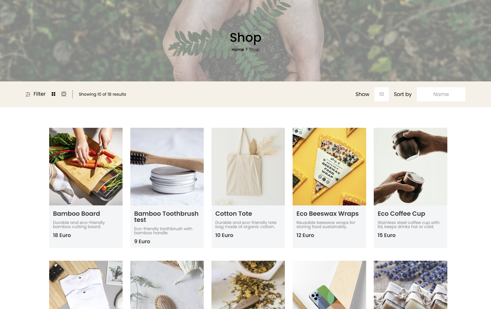

# Eco-Shop

## Presentation

You can watch the project presentation here:

[Eco-Shop Presentation](https://www.canva.com/design/DAGfY5IwwY0/Q9ejmKDTqwD4y1l1-YmvBQ/view?utm_content=DAGfY5IwwY0&utm_campaign=designshare&utm_medium=link2&utm_source=uniquelinks&utlId=hc936e4d8cb#1)


## Description
This project is the result of our second group collaboration: an online webshop inspired by eco-friendly products. 


---

## Technologies Used
This project includes both a front-end and back-end, each structured in its own folder with separate dependencies and configurations.

|  |  |  |
|------------------------------------------------------|------------------------------------------------------|------------------------------------------------------|
- ### Front-End:
    - **HTML**
    - **CSS**
    - **TypeScript**
    - **React** (with Vite)

- ### Back-End:
    - **Node.js**
    - **Express.js**
    - **TypeScript**
    - **MongoDB** (with Mongoose)
    - **JWT** (Authentication)
    - **EJS** (for server-side views)


## Instalation

```bash
git clone https://github.com/Steve-D3/GW2.git
cd [name of the folder]

#Front-end
cd client
npm install
npm run build
npm run start

#Back-end
cd server
npm install 
npm run build
npm run start

#For local development:
npm run dev
```

## Environment Variables

Create a `.env` file in the **server** folder and add the following:

```env
PORT=3000
MONGO_URI=your_mongodb_connection_string
JWT_SECRET=your_secret_key
```


## Project Structure

```
server  
├── src/                             
│   ├── controllers/                    # Handles business logic for each model  
│   ├── middleware/                     # Authentication and request-handling middleware  
│   │   ├── localAuthMiddleware.ts        
│   │   └── authMiddleware.ts           
│   ├── models/                         # Database models (schemas)  
│   │   ├── categoriesModel.ts            
│   │   ├── orderModel.ts                 
│   │   ├── productsModel.ts              
│   │   ├── reviewsModel.ts               
│   │   ├── usersModel.ts                 
│   │   └── wishlistModel.ts              
│   ├── routes/                         # Defines API routes for each controller  
│   ├── public/                         # Static assets   
│   │   ├── css/                          
│   │   ├── img/                          
│   │   └── js/                         
│   ├── types/                          # TypeScript type definitions  
│   │   └── index.ts                      
│   ├── utils/                          # Utility functions/helpers  
│   │   └── helper.ts                      
│   ├── views/                          # Server-side rendered views (EJS templates)  
│   │   ├── partials/                     
│   │   ├── ...                         # Additional views  
│   │   └── index.ejs                   # Main view template  
│   └── server.ts                       # Main entry point of the application  
│
├── dist/                               # Compiled output (auto-generated)  
├── package.json                        # Project dependencies and scripts  
├── .gitignore                          # Files and folders to exclude from Git  
└── tsconfig.json                       # TypeScript configuration  

```

## API Endpoints

 Authentication & User Management:
| Method | Endpoint                | Description                      |
|--------|-------------------------|----------------------------------|
| POST   | /api/auth/register      | Register a new user (Admin)      |
| POST   | /api/auth/login         | Login a user  (Admin)            |
| POST   | /api/auth/logout        | Logout a user  (Admin)           |
| GET    | /api/users/:id          | Get user profile by ID           |
| PUT    | /api/users/:id          | Update user profile by ID        |
| DELETE | /api/users/:id          | Delete user account              | 

Product Management:
| Method | Endpoint             | Description                  |
|--------|----------------------|------------------------------|
| GET    | /api/products        | Get all products             |
| GET    | /api/products/:id    | Get a product by ID          |
| POST   | /api/products        | Create a new product (Admin) |
| PUT    | /api/products/:id    | Update a product (Admin)     |
| DELETE | /api/products/:id    | Delete a product (Admin)     |


## License

This project is licensed under the [MIT License](LICENSE).

---
## Credits  
- [@amirabayoumi](https://github.com/amirabayoumi)  
- [@moonscryer](https://github.com/moonscryer)  
- [@Rafael-Creator-max](https://github.com/Rafael-Creator-max)  
- [@Steve-D3](https://github.com/Steve-D3) 

